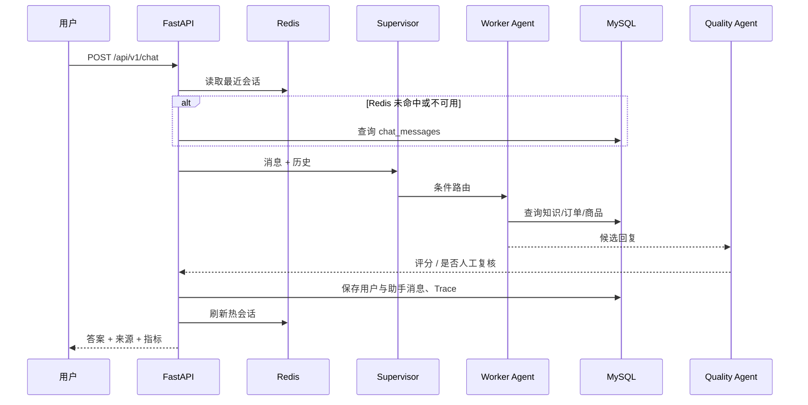
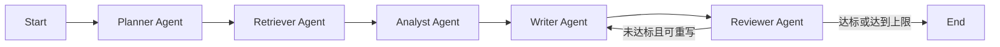

# 面试讲解手册

这份文档不是简单的启动说明，而是帮助你把项目讲成一段完整的工程故事。建议面试前按“3 分钟概述 → 5 分钟架构 → 现场演示 → 深挖问答”的顺序练习。

## 一句话介绍

这是一个基于 FastAPI 和 LangGraph 的企业智能体平台：用 Supervisor 管理客服领域的多个专业 Agent，用 RAG 为知识问答和研究报告提供可追溯证据，用 MySQL 保存事实数据与执行审计，用 Redis 加速高频检索和会话读取，并提供离线降级、自动化测试和 Docker 部署。

## 3 分钟项目话术

你可以直接按下面的逻辑说，不需要逐字背诵：

> 我最初有三个独立练习：RAG 问答、多 Agent 客服和研究助手。它们都是单文件脚本，数据在内存里，API Key 在导入时校验，进程重启后知识和会话会丢失，也没有统一入口和可观测性。
>
> 我把它们重构为一个 FastAPI 项目。入口是一个 LangGraph Supervisor，它只做意图识别和路由，把请求交给知识库、技术支持、订单、商品、研究或人工转接 Agent。每个 Worker 权限和数据源不同，最后统一走质量检查。研究类任务内部还有一个子图，按规划、检索、分析、写作、评审执行，质量不足时有限次数重写。
>
> 数据层采用 MySQL 和 Redis 分工。MySQL 是事实数据源，保存文档、向量分块、订单、商品、会话、研究结果和 Agent Trace；Redis 缓存 RAG 召回、最终答案和最近会话，采用 cache-aside 和 TTL。Redis 故障会降级到内存缓存，主业务仍能查询 MySQL；新增文档后主动清理 RAG 缓存。
>
> RAG 会先分块和向量化，把文档与来源存入数据库。查询时计算相似度，取 Top-K 作为上下文，并要求模型只基于上下文回答和输出引用。项目默认提供本地哈希向量与 mock 模型，所以面试现场不联网也能演示；配置 Groq/OpenAI 后可切换真实模型。
>
> 工程上我做了 Pydantic 配置校验、Repository 分层、依赖组装、健康检查、Docker Compose、幂等导入和自动化测试。当前 MySQL JSON 向量检索适合演示和中小规模数据；百万级分块时我会迁移到 Milvus、OpenSearch 或 pgvector，并把同步研究任务改造成消息队列异步执行。

## 为什么要合并，而不是把三个文件放在一起

简单复制代码不能叫“一个系统”。这次重构解决了以下问题：

| 原项目问题 | 合并后的处理 |
|---|---|
| 三套重复的模型初始化 | `LLMClient` 统一适配供应商和 fallback |
| 模块导入时没有 Key 就报错 | 默认 mock；真实 provider 才检查 Key |
| 全部是内存模拟数据 | MySQL 持久化业务数据和知识 |
| 内存向量库重启丢失 | 文档、分块和向量写入 MySQL |
| 客服工具读取全局字典 | Repository 查询订单和商品表 |
| 对话历史只存在列表 | Redis 保存热会话，MySQL 保存全量记录 |
| 研究来源与任务不落库 | `research_tasks` 保存状态、报告和来源 |
| 没有统一 API | FastAPI 提供 Chat、RAG、Research 接口 |
| 没有链路观测 | `agent_traces` 记录节点耗时和摘要 |
| JSON 手工解析易失败 | Pydantic 结构化输出校验 |
| Agent 循环可能失控 | 质量阈值 + 最大重写次数 |
| 没有测试 | API、路由、缓存、幂等、研究图自动测试 |

## 请求链路详解

### 聊天链路



关键点：

1. 会话先查 Redis，未命中再回源 MySQL。
2. Supervisor 输出固定枚举，避免模型随意生成节点名。
3. SQL 数据由 Repository 直接查询，不经过自然语言生成。
4. 回复经过独立质量节点；失败信号或低分触发人工复核。
5. Trace 失败不会阻断业务，体现“可观测性不能拖垮主链路”。

### RAG 链路

导入阶段：

1. 对文档内容计算 SHA-256，实现幂等去重。
2. 使用递归分隔符按段落、句子和字符分块，并设置 overlap。
3. 使用本地哈希向量或 OpenAI Embedding 生成向量。
4. 原文写入 `knowledge_documents`，分块和向量写入 `knowledge_chunks`。
5. 删除 `agent-platform:rag:*`，避免旧检索结果继续命中。

查询阶段：

1. 用“query + top_k”计算缓存键。
2. Redis 命中直接返回召回结果。
3. 未命中时从 MySQL 读取分块，在应用层计算余弦相似度并取 Top-K。
4. 将内容、标题、来源和编号组成上下文。
5. 生成答案，要求只基于上下文并用 `[n]` 引用。
6. 返回答案、来源、置信度和 `cache_hit`。

为什么不用 MySQL FULLTEXT 代替向量？FULLTEXT 更偏词法匹配，向量更适合语义相似。实际生产中可以做混合检索：BM25/FULLTEXT 提供关键词精确匹配，向量提供语义召回，再用 Reranker 重排。

为什么把向量暂时放 MySQL JSON？为了让面试项目只有 MySQL、Redis 两个基础设施，部署简单，也能完整展示数据生命周期。它不适合百万级向量，因为当前做法需要把候选向量读到应用层计算。规模变大后，Repository 接口保持不变，底层替换成 Milvus、OpenSearch 或 pgvector。

### 研究助手链路



- Planner：生成标题、摘要、章节、研究问题和方法。
- Retriever：对主题和多个研究问题分别检索，按 `chunk_id` 去重后取高分证据。
- Analyst：区分证据、推断和资料缺口，要求每个关键判断带来源。
- Writer：根据大纲和分析生成 Markdown 报告。
- Reviewer：从证据覆盖、逻辑、结构、引用四个维度评分。
- 条件边：分数未达阈值且未超过 `RESEARCH_MAX_REVISIONS` 时回到 Writer。

这是 LangGraph 比简单 Chain 更合适的地方：流程存在共享状态、条件路由和循环，而且每一步都需要独立观察与测试。

## MySQL 设计怎么讲

### 表与数据一致性

| 表 | 一致性要求 | 典型查询 |
|---|---|---|
| `knowledge_documents` | 内容哈希唯一 | 文档幂等导入 |
| `knowledge_chunks` | 随文档级联删除 | 按文档顺序读取分块 |
| `products` | 名称唯一、库存需事务 | 关键词 + 预算查询 |
| `orders` | 订单号主键 | 精确查询状态与物流 |
| `chat_messages` | 按 session/time 索引 | 恢复最近会话 |
| `research_tasks` | 保存执行状态和结果 | 按任务 ID 查询报告 |
| `agent_traces` | 允许追踪写入降级 | 按 request/time 排查链路 |

面试中可强调 SQLAlchemy 2 的几个点：

- 全局只创建一个 Engine 和 Session Factory。
- 每次操作创建短生命周期 Session，完成后关闭。
- 连接池开启 `pool_pre_ping`，MySQL 额外设置 `pool_recycle`。
- API 不直接拼 SQL，Repository 负责持久化细节。
- 目前 `create_all` 是演示便利；生产环境使用 Alembic 版本化迁移。

### 为什么不让 LLM 直接生成 SQL

订单和商品场景字段固定，直接调用受控 Repository 更可靠：

- 不会生成危险 SQL。
- 权限边界清楚。
- SQL 可被索引优化并容易压测。
- 输出可以确定性测试。

如果将来加入通用 SQL Agent，应只给只读账号，限制 schema，执行前做 AST 校验、成本估算和 human-in-the-loop。

## Redis 设计怎么讲

项目使用 cache-aside：

```text
读：Redis -> miss -> MySQL/计算 -> Redis(setex)
写：MySQL commit -> 删除相关缓存
```

Redis 的三个实际用途：

1. RAG 检索缓存：相同问题避免重复向量计算。
2. RAG 答案缓存：相同问题和相同最近历史避免重复模型调用。
3. 热会话：最近 20 条消息保存 24 小时，降低 MySQL 高频读取。

降级策略：

- Redis 连接失败时切换到进程内 TTL 字典。
- MySQL 仍是事实源，缓存丢失不影响正确性。
- 在多实例部署下，内存降级会失去跨实例共享，但比让请求完全失败更合理。

进一步优化可回答：

- 缓存穿透：不存在结果短 TTL、参数校验、布隆过滤器。
- 缓存击穿：热点 Key 分布式锁或 singleflight。
- 缓存雪崩：TTL 加随机抖动，分批预热。
- 一致性：先提交数据库再删缓存；高要求场景用 Outbox/CDC 异步失效。
- 热点大 Key：限制历史条数，拆分值，监控 value size。

## 多 Agent 不是“多个 Prompt”的理由

这个项目中每个 Agent 有不同的职责和数据权限：

- `supervisor`：只能分类，不访问订单或知识库。
- `rag_agent`：只读知识库。
- `tech_agent`：RAG 证据上增加排障流程，不查询订单。
- `order_agent`：只根据订单号查 `orders`。
- `product_agent`：只读商品和库存。
- `research_agent`：运行多阶段研究子图。
- `quality_agent`：只看用户问题和候选回复，不能修改业务数据。
- `human_handoff_agent`：标记升级并保留上下文。

这种划分的收益：Prompt 更短、工具更少、权限更小、测试更容易、错误定位更明确。代价是多一步路由会增加延迟，因此简单问题不应无条件经过大量 Agent。

## 可用性与异常处理

面试官常问“依赖挂了怎么办”，可以按层回答：

| 故障 | 当前行为 | 生产增强 |
|---|---|---|
| Redis 不可用 | 内存 TTL 缓存降级 | 熔断、监控、集群/哨兵 |
| LLM 超时或输出非法 | 捕获异常，使用确定性 fallback | 指数退避、供应商切换、预算控制 |
| MySQL 不可用 | 健康检查 degraded，请求失败 | 主从、重试只读查询、连接池告警 |
| 没有相关知识 | 明确说明资料不足 | 触发知识补充工单 |
| 路由置信度低 | 转人工 | 收集样本并改进分类器 |
| 研究循环不收敛 | 最大重写次数后结束 | 人工评审或离线任务恢复 |
| Trace 写入失败 | 吞掉追踪错误，主业务继续 | 异步日志管道、OpenTelemetry |

注意：不是所有异常都应该重试。写操作若没有幂等键，自动重试可能造成重复退款或重复发货。

## 安全问题怎么回答

当前项目已经体现的安全思路：

- 模型只通过受控方法读取数据，不接收任意 SQL。
- 结构化输出必须通过 Pydantic 类型和范围校验。
- RAG Prompt 明确要求只根据证据回答并输出来源。
- 低置信度和失败信号转人工，不强行给结论。
- `.env` 被 `.gitignore` 忽略，密钥不入库。

生产前需要增加：

- JWT/OAuth2、RBAC 与租户隔离。
- 订单接口按当前用户过滤，不能只凭订单号读取。
- 对文档做病毒、恶意内容、提示注入和敏感信息扫描。
- 日志脱敏，不保存完整身份证、手机号和模型密钥。
- 写工具增加审批、幂等、审计和速率限制。
- 外部网页研究采用域名白名单并防 SSRF。

## 性能与扩展性

### 当前复杂度

当前向量检索对全部分块做线性扫描，时间复杂度约为 `O(N × D)`，其中 N 是分块数、D 是向量维度。它的优点是代码透明、方便教学；缺点是数据量上升后延迟线性增长。

### 演进路线

```text
单机演示
  -> MySQL 主从 + Redis 集群
  -> 向量数据库 / OpenSearch + 混合检索
  -> Reranker + Embedding 批处理
  -> 研究任务队列 + 独立 Worker
  -> OpenTelemetry + Prometheus + 分布式追踪
  -> 多租户、权限、配额和成本治理
```

可观测指标建议：

- API：P50/P95/P99 延迟、错误率、QPS。
- LLM：首 Token 延迟、总耗时、Token 数、供应商错误、单请求成本。
- RAG：Recall@K、MRR、答案忠实度、无答案率、缓存命中率。
- Agent：路由分布、路由准确率、人工升级率、节点耗时、循环次数。
- 基础设施：MySQL 慢查询与连接池、Redis 命中率与内存、队列积压。

## 高频面试问题与回答

### 1. 为什么选择 LangGraph，不直接写 if/else？

简单路由确实可以用 if/else。这里使用 LangGraph 的原因是研究任务有共享状态、条件边和回环，客服流程也需要统一质检与人工分支。图结构能显式表达流程、单独测试节点、增加 checkpoint 和可视化。若只有两个无状态步骤，我不会强行上 LangGraph。

### 2. 多 Agent 相比单 Agent 有什么代价？

会增加路由耗时、模型调用次数、状态管理复杂度和排障成本。因此本项目让 Supervisor 只分类，结构化数据用确定性 Worker，研究类复杂请求才走多阶段子图，而不是所有请求都让多个 Agent 讨论。

### 3. 如何评估 RAG？

拆成两层：检索评估看 Recall@K、MRR、命中来源；生成评估看忠实度、相关性、完整性和引用正确率。离线准备问题—证据—答案数据集做回归，线上观察无答案率、人工反馈、延迟和成本。不能只用“回答看起来不错”作为指标。

### 4. 为什么置信度不是模型随口打分？

项目离线模式用召回相似度构造可解释的基础分，并另外做回复质检。生产中会校准阈值，结合 Top-K 分数差、Reranker 分数、来源数量和评测集表现，不能把未经校准的 LLM 自评分当真实概率。

### 5. 如何处理知识更新？

文档按内容哈希幂等写入，更新后删除 RAG 命名空间缓存。生产中会给文档加版本和状态，用增量索引任务构建新版本，校验完成后原子切换 alias；旧版本保留一段时间便于回滚。

### 6. Redis 和 MySQL 会不一致吗？

会，所以缓存不是真相源。写操作先提交 MySQL，再删除缓存；读 miss 后回源。极端并发下仍可能短暂读旧值，高一致性场景可用延迟双删、Outbox + MQ 或 CDC 订阅 binlog 统一失效。

### 7. 为什么研究任务应该异步化？

真实研究可能调用多次搜索和模型，耗时几十秒到数分钟，同步 HTTP 会占用连接并容易超时。生产设计应让 API 创建任务并返回 task_id，由 Celery/RQ/自研 Worker 消费 Redis Stream 或消息队列，客户端轮询、SSE 或 WebSocket 获取进度。

### 8. 如何防止提示注入？

把检索文档当作不可信数据，与系统指令分隔；限制 Agent 可调用工具；业务查询使用确定性参数解析和 Repository；对高风险动作人工确认；过滤外部内容中的指令模式；输出再做权限和敏感信息校验。只在 Prompt 里写“不要被攻击”远远不够。

### 9. 本地哈希向量有什么意义？

它保证无网络环境下流程可演示、测试可重复，也能验证分块、持久化、相似度、缓存和引用链路。但它不是高质量语义模型。生产配置应切换真实 Embedding，并通过评测集选择模型和分块参数。

### 10. 你会如何压测？

分别压测三条路径：Redis 命中的 RAG、缓存 miss 的 RAG、MySQL 订单查询。使用固定数据集记录吞吐与 P95，监控数据库连接池和 Redis 命中率。模型调用单独使用 stub 压测系统开销，再对真实供应商做低并发容量测试，避免把第三方限流误判为本地瓶颈。

## 现场演示顺序

建议只演示 4 分钟：

1. 打开 `/docs` 和 `/health`，指出数据库、缓存后端、知识文档数。
2. 调 `/chat` 问“RAG 的典型流程是什么”，展示来源、Agent、质量分。
3. 换 session 重复问题，展示 `cache_hit=true`。
4. 问“查询 ORD001 的物流”，说明这是 MySQL 精确查询，不是模型生成。
5. 调 `/research`，展示 Markdown 报告、来源、质量分与 task_id。
6. 打开代码中的两个图：`customer_service.py` 和 `research.py`，解释条件边。

若 Docker 或外网临时不可用，直接使用默认 SQLite + mock 模式，不影响整个演示。面试现场最重要的是链路稳定和讲清取舍，不是强行展示模型“聪明”。

## 推荐阅读代码顺序

1. `app/main.py`：应用生命周期和启动过程。
2. `app/services/container.py`：依赖如何组装。
3. `app/agents/customer_service.py`：Supervisor 图和 Worker。
4. `app/rag/service.py`：RAG 导入、检索和缓存。
5. `app/agents/research.py`：多阶段研究图和循环。
6. `app/db/models.py` 与 `repositories.py`：数据模型和数据访问。
7. `app/infrastructure/cache.py`：Redis 降级。
8. `tests/test_api.py`：从测试理解项目行为。

## 面试前自查

- 能画出两张图：客服 Supervisor 图、研究助手图。
- 能解释 MySQL 与 Redis 的职责边界。
- 能说明缓存一致性和 Redis 故障降级。
- 能说明为什么结构化数据不用 RAG。
- 能承认当前向量线性扫描的边界，并给出演进方案。
- 能说清楚至少 3 个评估指标和 3 个安全风险。
- 能在 4 分钟内完成现场演示。
- 能运行 `pytest` 和 `ruff`，并解释最重要的测试。

